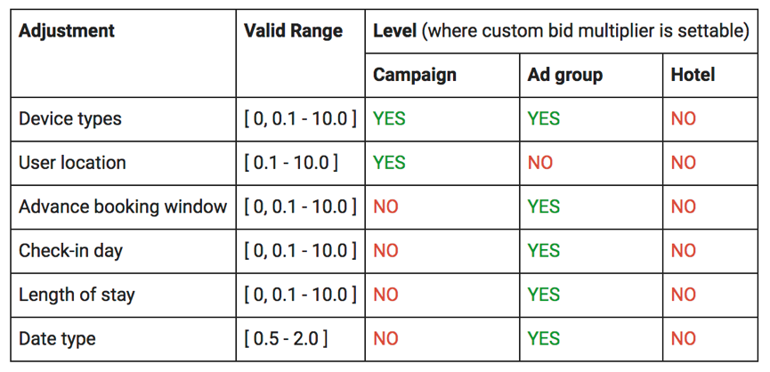

# Campaigns bidding guide
This section explains how bidding and bid strategies work with campaigns, and includes the following topics:

* Overview
* Choosing a bid strategy
* Manual bid multipliers and campaigns

## Overview
Hotels and ad groups within a campaign all use the same bid strategy, which is set at the campaign level. Every campaign has a campaign default bid which will be used for all ads in that campaign. Depending on the bid strategy you select, you can optionally set more granular bids at the ad group or individual hotel level.  
If you want to use different bidding strategies, you can do so by creating multiple campaigns or groups. For example:

* Set up different campaigns that target different ad groups and hotels.
* Set up different campaigns that target different user countries.
* Pause ad groups or hotels from appearing in one campaign and run them in another campaign that has a different bid strategy.

If you change an existing campaign bid strategy, any existing ad group and hotel-level bids will be adjusted based on a new strategy. Ad groups will remain unchanged, and any paused ad groups or hotels will remain paused.

## Choosing a bid strategy
* Smart Bidding strategies  

| Bidding strategy | Type | When to use | Optimizes for | What you can control |
| :-: |:-:| :-:| :-: | :-: |
| Target ROAS | Automated | You want to automatically adjust your bids for every auction based on an expected return on ad spend. | Conversion value | Return on ad spend Campaign budget |
| Average Position | Automated | You want to keep a relatively stable average position.  | Exposure | Campaign budget Average position at campaign/country level |
| Share of Voice | Automated | You want to control impression share with automatic bid adjustments. | Exposure | Impression share Campaign budget|

* Manual bidding strategy

| Bidding strategy | Type | When to use | Optimizes for | What you can control |
| :-: |:-:| :-:| :-: | :-: |
| Max CPC – Percentage of Room Price | Manual | You want to maximize clicks by bidding a percentage of the hotel price per night. You want to manually adjust bid multipliers.| Clicks | Campaign budget Cost-per-click Base Bid Bid multipliers |

## Manual bid multipliers and campaigns
Bid multipliers are used to adjust bids up or down based on factors such as the end-user's device, country, or itinerary.  
You can use manual bid multipliers with the following bid strategies:  

* Max CPC – Percentage of Room Price

The following table shows the valid range of values and levels at which manual bid multipliers can be applied:  
  
If an ad group has a device multiplier set, that value will be used instead of the campaign device multiplier. For example, if a campaign sets the device type multiplier for desktop devices to 2, and the ad group sets it to 1.5, the ad group multiplier of 1.5 will be used.
