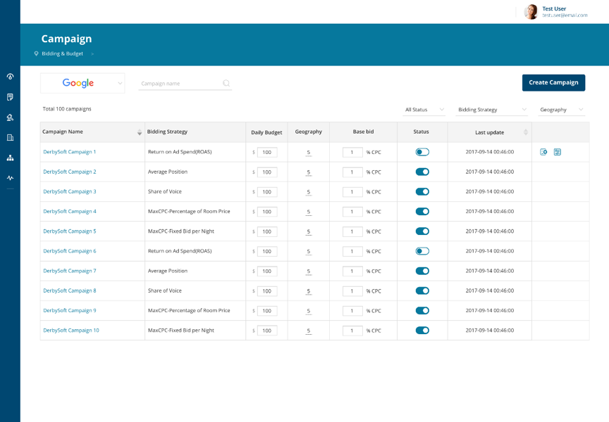
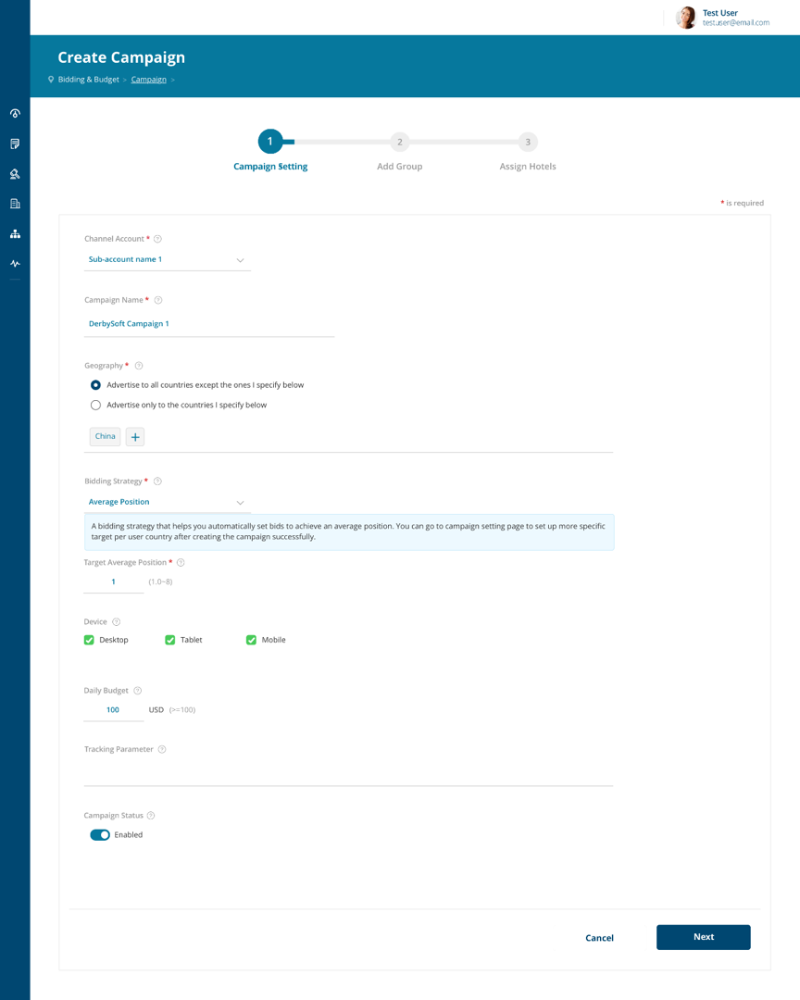
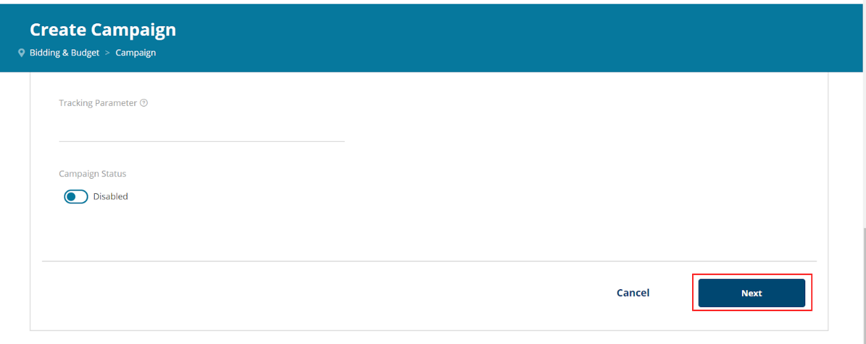
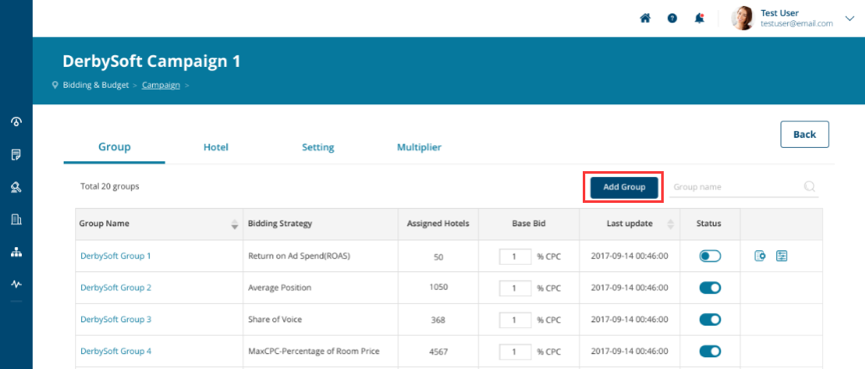
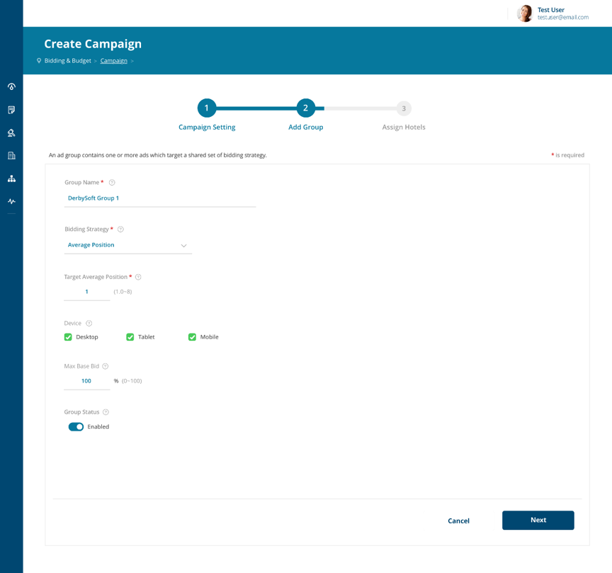
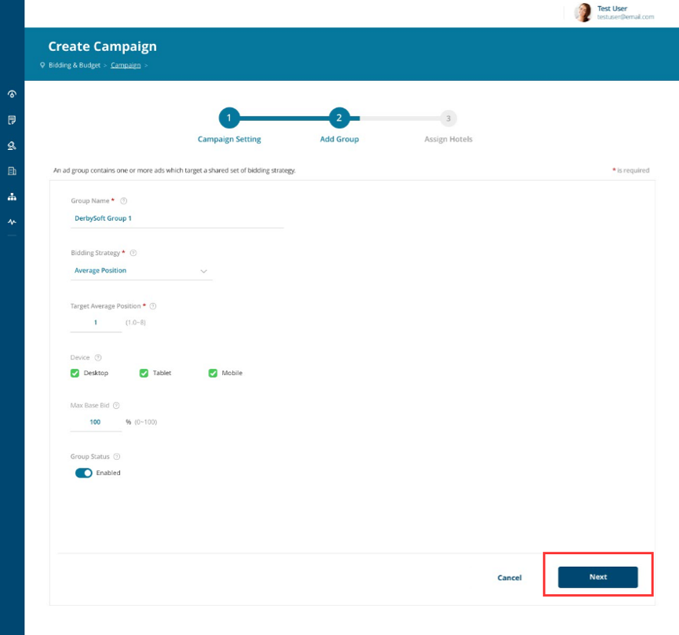
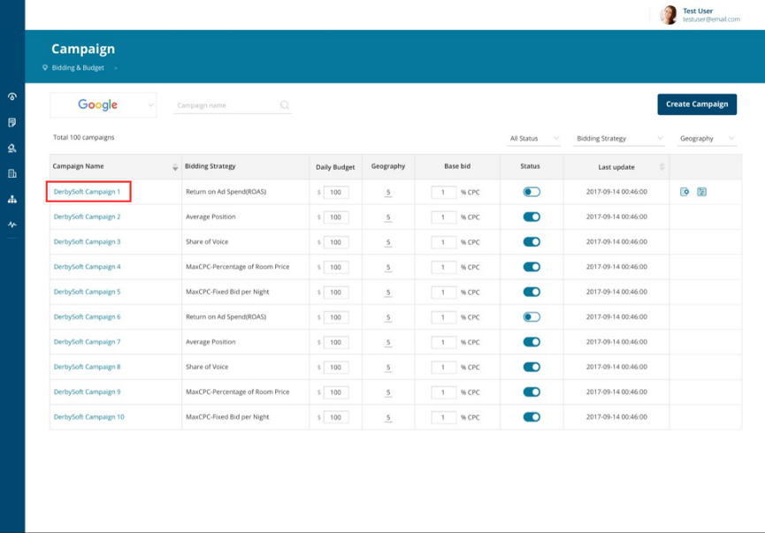
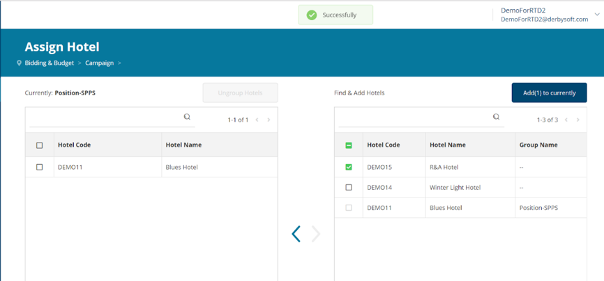
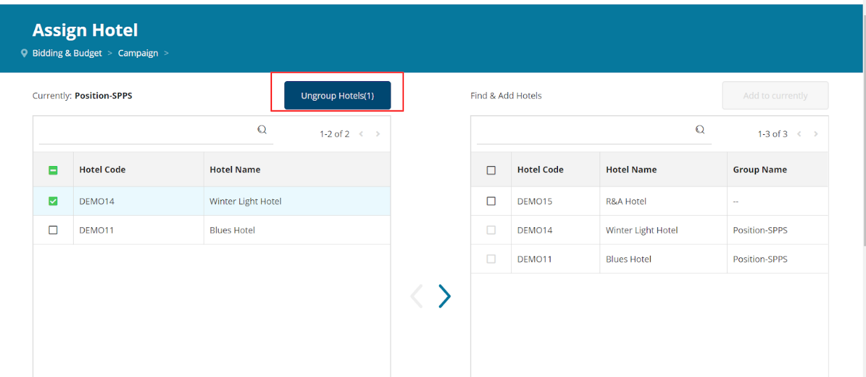

# Create campaign, Add Group and Assign Hotel
## Create a new campaign

To get started on Campaigns, you must first create a new campaign. We recommend you start slowly: create one campaign and try it out before you start using several campaigns for all of your target markets or hotels.

1. Open **MetaSearch Manager** in a browser.
2.	Select the **Bidding & Budget – Campaign** tab.
3.	Click the **Create Campaign** button.  

4.	The "Create Campaign" dialog appears. Enter a name for the campaign and define the other settings, including geographic targeting. The actual fields that are displayed depend on the bidding strategy that you select.
5. By default, a new campaign is **Inactive**. Set the campaign status to **Enable** if you're ready for the campaign to be live. (**Note**: You can also enable campaigns from the Campaign List page.)  

6.	Click the **Next** button and a new campaign will be created. This process may take up to 60 seconds to complete.

*By default, we will continue to lead the process for you to create Ad Group and Assign Hotel when the campaign is created for the first time. You can also complete the last two remaining processes later. This can be done within the Campaign Page. 

## Create a new ad group
An ad group is a group of hotels defined in the context of each campaign. You typically use ad groups to:

* Group hotels with similar performance, for example your top-converting hotels.
* Set group-level bids or bid multipliers.
* Target only a subset of the hotels in your account by pausing one or more ad groups.

To Create a new ad group

1.	There are 2 ways to create a new ad group:  
	1. Continue to Add Group after created a new campaign by clicking the “Next” button.  

	2.	In the Campaign list, click on the campaign you'd like to edit.  
  
You're now in "Campaign Details." Click “Add Group” at the top of the page:  
 
2.	Enter a name for the ad group. Please note, each ad group must have a unique name within the campaign.
3.	Click the **Next** button to create a new, empty ad group. If the ad group is created successfully, the next step will be “Assign Hotels”  

## Assign hotels to an ad group
The last step before your bids are active is to assign hotels to an ad group.

1.	Continue to Assign Hotel after having created a new ad group by click “Next” button.  

	Or in the campaign list, click on the campaign you'd like to edit.  

2.	You're now in "Campaign Details." Click “Hotel” tab; Select a specific Ad Group and you will see Assign Hotel button is activated.  

3.	Click **Assign Hotel** on the top menu. A list of hotels in the ad group will show. If it's a new ad group, the list will be empty. Any hotels that aren't yet in an ad group will appear as "ungrouped" on the right side of the view: 
4.	On the right, select the checkboxes next to the hotels you want to add to the ad group.
5.	To move the selected hotels to the ad group that you are currently editing, click the blue arrow or Add to current.  

**Notes:**

* Hotels can only be members of one ad group at a time. To return a hotel to the "ungrouped" status, you need to select the hotel's current ad group, select the checkboxes next to the hotels you wish to ungroup. Click the blue arrow or click the Ungroup Hotels button.  

* You can't move an ad group from one campaign to another. If you want the same or a similar ad group in multiple campaigns, you must create one for each campaign.