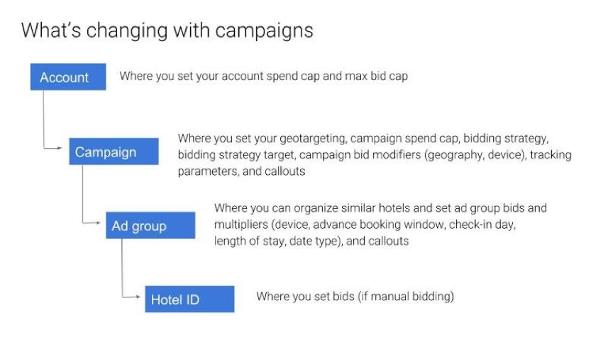

# Overview

Google Campaigns allows you to manage your Hotel Ads bids and budgets across multiple campaigns, targeting different user countries and hotels, and choosing different bid strategies for each campaign. This article includes the following topics:  

* Benefits of Campaigns
* How Campaigns are structured
* Targeting
* Using ad groups
* Budgeting
* Bidding
* Tracking

## Benefits of Campaigns
* **Target bids** at a specific combination of user countries (origin) and set of hotels (destination). For example, you can reach US and Canadian customers looking at hotels in Latin America.
* **Set distinct budgets** per campaign. For example, set a $1,000 per day **budget** for the EMEA region and a $5,000 per day budget for the US and Canada.
* **Use distinct bid strategies** per campaign, depending on your objectives and desire to use automated bidding or manual bidding controls.
* **Modify bids and budgets** for one campaign without affecting any others. For example, you can update device multipliers for all hotels in a campaign targeting the Asia Pacific region, but the EMEA campaign's device multipliers and performance remain unchanged.
* **Optimize** for different traffic segments, such as mobile users in a particular country. For example, you can set up two campaigns for US and Canadian customers. Have one campaign target desktop users and the second campaign target mobile/tablet users.

## How Campaigns are structured
A campaign is a set of ad groups (targeted hotels and bids) that share a budget, user location targeting, and other settings. Instead of a single bid per hotel within an account, you can now set up multiple campaigns per account to run in parallel, each advertising your hotels to differently targeted user countries or traffic segments.  
You can create campaigns in a master account or in your sub-accounts. Each campaign can bid on all of the hotels in your account's Hotel List feed, or you can pause some hotels in your campaign to only target specific hotels.  
The following image shows the architecture of a Hotel Ads account that uses Campaigns.  

Please note Campaigns have the following limits:  

* 50 campaigns per account (this includes all sub-accounts)
* 2,000 ad groups per campaign

## Targeting
Each campaign targets a combination of user country and hotel list.  
By default, a new campaign will target all user countries. You can use the campaign settings tool to select specific countries to target or exclude.

You can create ad groups to divide your hotels into groups you will target and bid on, or exclude ad groups from a campaign by setting them to be paused. Individual hotels can also be paused in a campaign. 

**\*Keep in mind**: 
When multiple campaigns from an account target an impression -- the same user country and hotel ID -- only one campaign enters the auction to prevent self-competition and double-serving. The campaign with the highest effective bid enters the auction.

## Using ad groups
Within each campaign, you can create ad groups, these ad groups:

* Organize your hotels, and measure performance of groups of hotels in your campaign.
* Group similar hotels to improve Smart Bidding performance. For example, you may want to group top-performing hotels, or hotels in a specific region, into a similar group.
* Target specific hotels in your campaign, such as hotels in a specific region, or from a specific brand.
* Set bid overrides and bid multipliers for groups of hotels if you use manual bidding such as Max CPC.

## Budgeting
You can set a daily **spending cap** on each campaign.

## Bidding
For each campaign you must select a bid strategy. Hotels which are assigned to an ad group under that campaign will use the same bidding strategy. This bid strategy can be one of the following (for each campaign/ad group):  
**Smart Bidding strategies**.  

* Return on ad spend (ROAS)
* Average Position
* Share of Voice (SOV）

**Manual bidding strategies**

* Max CPC – Percentage of Room Price

**Tracking Parameter**: A custom value for the campaign. This can be any campaign-specific information that you want to include in the URL. 

